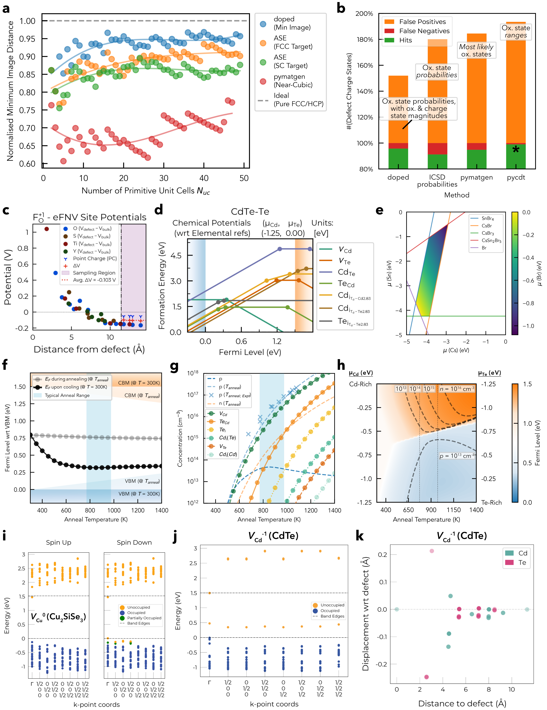

[](https://github.com/SMTG-Bham/doped/actions)
[](https://doped.readthedocs.io/en/latest/)
[](https://pypi.org/project/doped)
[](https://anaconda.org/conda-forge/doped)
[](https://pypi.org/project/doped)
[](https://doi.org/10.21105/joss.06433)

<a href="https://doped.readthedocs.io/en/latest/"></a>`doped` is a Python software for the generation, pre-/post-processing and analysis of defect supercell calculations, implementing the defect simulation workflow in an efficient, reproducible, user-friendly yet powerful and fully-customisable manner.

Tutorials showing the code functionality and usage are provided on the [docs](https://doped.readthedocs.io/en/latest/) site, and an overview of the key advances of the package is given in the [JOSS paper](https://doi.org/10.21105/joss.06433).

<a href="https://doi.org/10.21105/joss.06433"></a>

## Key Features
All features and functionality are fully-customisable:
- **Supercell Generation**: Generate an optimal supercell, maximising periodic image separation for the minimum number of atoms (computational cost).
- **Defect Generation**: Generate defect supercells and guess likely charge states based on chemical intuition.
- **Calculation I/O**: Automatically write inputs and parse calculations (`VASP` & other DFT/force-field codes).
- **Chemical Potentials**: Determine relevant competing phases for chemical potential limits, with automated calculation setup, parsing and analysis.
- **Defect Analysis**: Automatically parse calculation outputs to compute defect formation energies, finite-size corrections (FNV & eFNV), symmetries, degeneracies, transition levels, etc.
- **Thermodynamic Analysis**: Compute (non-)equilibrium Fermi levels, defect/carrier concentrations etc. as functions of annealing/cooling temperature, chemical potentials etc.
- **Plotting**: Generate publication-quality plots of defect formation energies, chemical potential limits, defect/carrier concentrations, Fermi levels, charge corrections, etc.
- **`Python` Interface**: Fully-customisable, modular `Python` API. Plug-and-play w/[`ShakeNBreak`](https://shakenbreak.readthedocs.io) – [defect structure-searching](https://www.nature.com/articles/s41524-023-00973-1), [`easyunfold`](https://smtg-bham.github.io/easyunfold/) – band unfolding, [`CarrierCapture.jl`](https://github.com/WMD-group/CarrierCapture.jl)/[`nonrad`](https://nonrad.readthedocs.io/en/latest/) – non-radiative recombination etc.
- Reproducibility, tabulation, automated compatibility/sanity checking, strain/displacement analysis, shallow defect analysis, high-throughput compatibility, Wyckoff analysis...

### Performance and Example Outputs

**(a)** Optimal supercell generation comparison. **(b)** Charge state estimation comparison. Example **(c)** Kumagai-Oba (eFNV) finite-size correction plot, **(d)** defect formation energy diagram, **(e)** chemical potential / stability region, **(f)** Fermi level vs. annealing temperature, **(g)** defect/carrier concentrations vs. annealing temperature and **(h)** Fermi level / carrier concentration heatmap plots from `doped`. Automated plots of **(i,j)** single-particle eigenvalues and **(k)** site
displacements from DFT supercell calculations. See the [JOSS paper](https://doi.org/10.21105/joss.06433) for more details.

## Installation
```bash
pip install doped  # install doped and dependencies
```

Alternatively if desired, `doped` can also be installed from `conda` with:

```bash
  conda install -c conda-forge doped
  pip install pydefect  # pydefect not available on conda, so needs to be installed with pip or otherwise, if using the eFNV correction
```

If you haven't done so already, you will need to set up your VASP `POTCAR` files and `Materials Project` API with `pymatgen` using the `.pmgrc.yaml` file, in order for `doped` to automatically generate VASP input files for defect calculations and determine competing phases for chemical potentials.
See the docs [Installation](https://doped.readthedocs.io/en/latest/Installation.html) page for details on this.

## Citation
If you use `doped` in your research, please cite:
- S. R. Kavanagh et al. [doped: Python toolkit for robust and repeatable charged defect supercell calculations](https://doi.org/10.21105/joss.06433). _Journal of Open Source Software_ 9 (96), 6433, **2024**

## `ShakeNBreak`
As shown in the `doped` tutorials, it is highly recommended to use the [`ShakeNBreak`](https://shakenbreak.readthedocs.io/en/latest/) approach when calculating point defects in solids, to ensure you have identified the groundstate structures of your defects. As detailed in the [theory paper](https://doi.org/10.1038/s41524-023-00973-1), skipping this step can result in drastically incorrect formation energies, transition levels, carrier capture (basically any property associated with defects). This approach is followed in the [doped example notebook](https://github.com/SMTG-Bham/doped/blob/main/dope_workflow_example.ipynb), with a more in-depth explanation and tutorial given on the [ShakeNBreak](https://shakenbreak.readthedocs.io/en/latest/) website.


## Studies using `doped`, so far

- X. Wang et al. **_Upper efficiency limit of Sb<sub>2</sub>Se<sub>3</sub> solar cells_** [_arXiv_](https://arxiv.org/abs/2402.04434) 2024
- I. Mosquera-Lois et al. **_Machine-learning structural reconstructions for accelerated point defect calculations_** [_arXiv_](https://doi.org/10.48550/arXiv.2401.12127) 2024
- W. Dou et al. **_Giant Band Degeneracy via Orbital Engineering Enhances Thermoelectric Performance from Sb<sub>2</sub>Si<sub>2</sub>Te<sub>6</sub> to Sc<sub>2</sub>Si<sub>2</sub>Te<sub>6</sub>_** [_ChemRxiv_](https://doi.org/10.26434/chemrxiv-2024-hm6vh) 2024
- K. Li et al. **_Computational Prediction of an Antimony-based n-type Transparent Conducting Oxide: F-doped Sb<sub>2</sub>O<sub>5</sub>_** [_Chemistry of Materials_](https://doi.org/10.1021/acs.chemmater.3c03257) 2023
- X. Wang et al. **_Four-electron negative-U vacancy defects in antimony selenide_** [_Physical Review B_](https://journals.aps.org/prb/abstract/10.1103/PhysRevB.108.134102) 2023
- Y. Kumagai et al. **_Alkali Mono-Pnictides: A New Class of Photovoltaic Materials by Element Mutation_** [_PRX Energy_](http://dx.doi.org/10.1103/PRXEnergy.2.043002) 2023
- S. M. Liga & S. R. Kavanagh, A. Walsh, D. O. Scanlon, G. Konstantatos **_Mixed-Cation Vacancy-Ordered Perovskites (Cs<sub>2</sub>Ti<sub>1–x</sub>Sn<sub>x</sub>X<sub>6</sub>; X = I or Br): Low-Temperature Miscibility, Additivity, and Tunable Stability_*** [_Journal of Physical Chemistry C_](https://doi.org/10.1021/acs.jpcc.3c05204) 2023
- A. T. J. Nicolson et al. **_Cu<sub>2</sub>SiSe<sub>3</sub> as a promising solar absorber: harnessing cation dissimilarity to avoid killer antisites_** [_Journal of Materials Chemistry A_](https://doi.org/10.1039/D3TA02429F) 2023
- Y. W. Woo, Z. Li, Y-K. Jung, J-S. Park, A. Walsh **_Inhomogeneous Defect Distribution in Mixed-Polytype Metal Halide Perovskites_** [_ACS Energy Letters_](https://doi.org/10.1021/acsenergylett.2c02306) 2023
- P. A. Hyde et al. **_Lithium Intercalation into the Excitonic Insulator Candidate Ta<sub>2</sub>NiSe<sub>5</sub>_** [_Inorganic Chemistry_](https://doi.org/10.1021/acs.inorgchem.3c01510) 2023
- J. Willis, K. B. Spooner, D. O. Scanlon **_On the possibility of p-type doping in barium stannate_** [_Applied Physics Letters_](https://doi.org/10.1063/5.0170552) 2023
- J. Cen et al. **_Cation disorder dominates the defect chemistry of high-voltage LiMn<sub>1.5</sub>Ni<sub>0.5</sub>O<sub>4</sub> (LMNO) spinel cathodes_** [_Journal of Materials Chemistry A_](https://doi.org/10.1039/D3TA00532A) 2023
- J. Willis & R. Claes et al. **_Limits to Hole Mobility and Doping in Copper Iodide_** [_Chemistry of Materials_](https://doi.org/10.1021/acs.chemmater.3c01628) 2023
- I. Mosquera-Lois & S. R. Kavanagh, A. Walsh, D. O. Scanlon **_Identifying the ground state structures of point defects in solids_** [_npj Computational Materials_](https://www.nature.com/articles/s41524-023-00973-1) 2023
- Y. T. Huang & S. R. Kavanagh et al. **_Strong absorption and ultrafast localisation in NaBiS<sub>2</sub> nanocrystals with slow charge-carrier recombination_** [_Nature Communications_](https://www.nature.com/articles/s41467-022-32669-3) 2022
- S. R. Kavanagh, D. O. Scanlon, A. Walsh, C. Freysoldt **_Impact of metastable defect structures on carrier recombination in solar cells_** [_Faraday Discussions_](https://doi.org/10.1039/D2FD00043A) 2022
- Y-S. Choi et al. **_Intrinsic Defects and Their Role in the Phase Transition of Na-Ion Anode Na<sub>2</sub>Ti<sub>3</sub>O<sub>7</sub>_** [_ACS Applied Energy Materials_](https://doi.org/10.1021/acsaem.2c03466) 2022
- S. R. Kavanagh, D. O. Scanlon, A. Walsh **_Rapid Recombination by Cadmium Vacancies in CdTe_** [_ACS Energy Letters_](https://pubs.acs.org/doi/full/10.1021/acsenergylett.1c00380) 2021
- C. J. Krajewska et al. **_Enhanced visible light absorption in layered Cs<sub>3</sub>Bi<sub>2</sub>Br<sub>9</sub> through mixed-valence Sn(II)/Sn(IV) doping_** [_Chemical Science_](https://doi.org/10.1039/D1SC03775G) 2021

## Acknowledgments
`doped` (née `DefectsWithTheBoys` #iykyk) has benefitted from feedback from many users, in particular
members of the [Scanlon](http://davidscanlon.com/) and [Walsh](https://wmd-group.github.io/) research groups who have used / are using it in their work. Direct contributors are listed in the `Contributors` sidebar above; including Seán Kavanagh, Alex Squires, Adair Nicolson, Irea Mosquera-Lois, Alex Ganose, Bonan Zhu, Katarina Brlec, Sabrine Hachmioune and Savya Aggarwal.

`doped` was originally based on the excellent `PyCDT` (no longer maintained), but transformed and morphed over time as more and more functionality was added. After breaking changes in `pymatgen`, the package was entirely refactored and rewritten, to work with the new
`pymatgen-analysis-defects` package.
