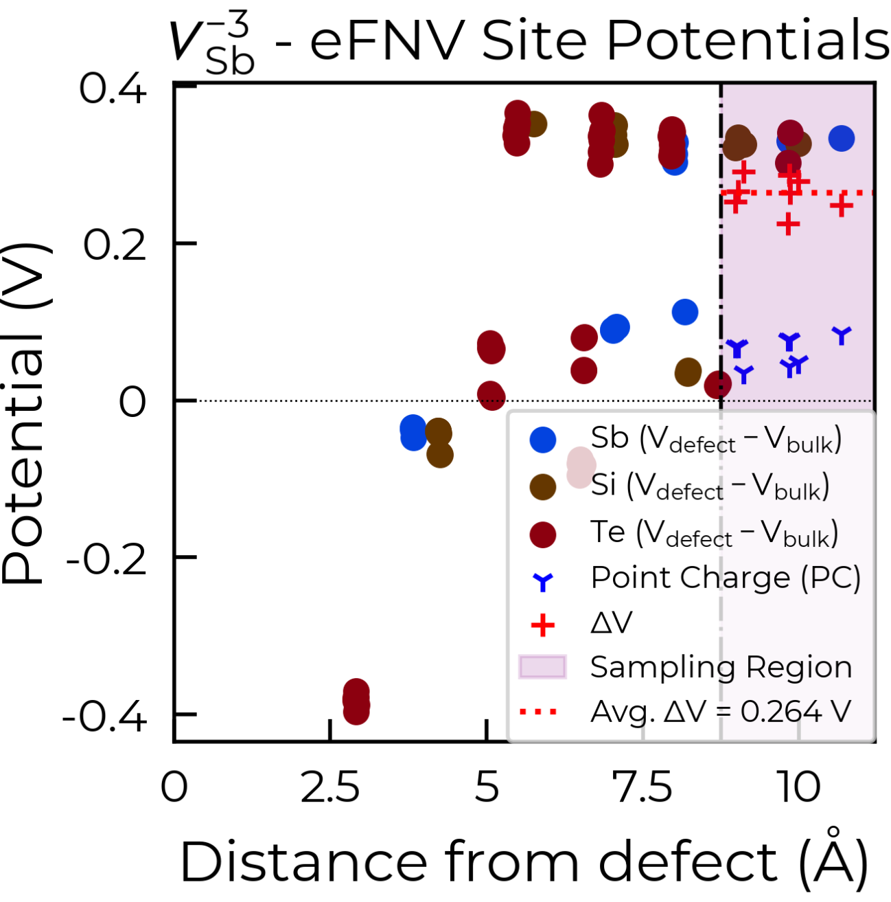

Tips & Tricks
============================

The development philosophy behind ``doped`` has been to build a powerful, efficient and flexible code
for managing and analysing solid-state defect calculations, having reasonable defaults (that work well for
the majority of materials/defects) with flexibility for the user to customise the workflow to
their specific needs/system.

.. note::
    While we provide some general rules-of-thumb for reasonable choices in the calculation workflow
    (based on the literature and our experience), there is no substitute for the user's own judgement.
    Defect behaviour is system-dependent, so it is `always` important to question and
    consider the choices and approximations made in the workflow (such as supercell choice, charge state
    ranges, interstitial site pruning, ``MAGMOM`` initialisation etc.) in the context of your specific
    host system.

Interstitials
-------------------
As described in the `YouTube defect calculation tutorial <https://youtu.be/FWz7nm9qoNg>`_, our
recommended workflow for calculating interstitial defects is to first generate the set of
candidate interstitial sites for your structure using ``DefectsGenerator`` (which uses Voronoi tessellation
for this, see note below), and then perform Gamma-point-only relaxations (using ``vasp_gam``) for each
charge state of the generated interstitial candidates, and then pruning some of the candidate sites based
on the criteria below. Typically the easiest way to do this is to follow the workflow shown in the defect
generation tutorial, and then run the ``ShakeNBreak`` ``vasp_gam`` relaxations for the ``Unperturbed`` and
``Bond_Distortion_0.0%``/``Rattled`` directories of each charge state. Alternatively, you can generate the
``vasp_gam`` relaxation input files by setting ``vasp_gam = True`` in ``DefectsSet.write_files()`` -- this
will rattle the output structures by default to break symmetry (controlled by the ``rattle`` option).

We can then compare the energies of these trial relaxations, and remove candidates that either:

- Are high energy (~>1 eV above the lowest energy site for each charge state), and so are unlikely to form.

- Relax to the same final structure/energy as other interstitial sites (despite different initial
  positions) in each charge state, and so are unnecessary to calculate. This can happen due to interstitial
  migration within the relaxation calculation, from an unfavourable higher energy site, to a lower energy
  one. Typically if the energy from the test ``vasp_gam`` relaxations are within a couple of meV of each other,
  this is the case.

.. tip::

    As with many steps in the defect calculation workflow, these are only rough general guidelines and
    you should always critically consider the validity of these choices in the context of your specific
    system (for example, considering the charge-state dependence of the interstitial site formation
    energies here).

.. note::

    As mentioned above, by default Voronoi tessellation is used to generate the candidate interstitial
    sites in ``doped``. We have consistently found this approach to be the most robust in identifying all
    stable/low-energy interstitial sites across a wide variety of materials and chemistries. A nice
    discussion is given in
    `Kononov et al. J. Phys.: Condens. Matter 2023 <https://iopscience.iop.org/article/10.1088/1361-648X/acd3cf>`_.

    As with all aspects of the calculation workflow, interstitial site generation is
    flexible, and you can explicitly specify the interstitial sites to generate using the
    ``interstitial_coords`` (for instance, if you only want to investigate one specific known interstitial
    site, or input a list of candidate sites generated from a different algorithm), and/or customise the
    generation algorithm via ``interstitial_gen_kwargs``, both of which are input parameters for the
    ``DefectsGenerator`` class;
    see the `API documentation <https://doped.readthedocs.io/en/latest/doped.generation.html#doped.generation.DefectsGenerator>`_
    for more details.

    Charge-density based approaches for interstitial site generation can be useful in some cases and often
    output fewer candidate sites, but we have found that these are primarily suited to ionic materials (and
    with fully-ionised defect charge states) where electrostatics primarily govern the energetics. In
    many systems (particularly those with some presence of (ionic-)covalent bonding) where orbital
    hybridisation plays a role, this approach can often miss the ground-state interstitial site(s).
    ..  If you are limited with computational resources and are working with (relatively simple) ionic compound(s), this approach may be worth considering.

Performance Bottlenecks
-----------------------

Generation
^^^^^^^^^^
For complex, low-symmetry systems, defect generation can take a little time (on the order of a couple
minutes). The ``doped`` algorithms have been heavily-optimised to expedite this process, and will use
multiprocessing by default to accelerate when multiple CPUs are available. The routines which are typically
the most computationally expensive for generation are supercell generation, interstitial generation and
Wyckoff/symmetry analysis (in order). As such, if you want to accelerate the generation process, you can
expedite these steps by:

- Providing your known desired supercell as input and setting ``generate_supercell=False``, to skip
  supercell generation (or using tighter supercell generation constraints with ``supercell_gen_kwargs``).
- Skipping interstitial generation with ``interstitial_gen_kwargs=False``, or using modified interstitial
  generation constraints (with ``interstitial_gen_kwargs``), or providing a list of known interstitial
  sites with ``interstitial_coords``.

Parsing
^^^^^^^
For defect calculation parsing, this can be slowed down in the case of large supercells, due to the large
sizes of the output ``vasprun.xml(.gz)`` files. Again, ``doped`` has been heavily-optimised to expedite this
process, and will use multiprocessing by default to accelerate when multiple CPUs are available. The main
bottleneck here is the loading and parsing of ``vasprun.xml(.gz)`` files. Parsing only has to be run once
however, and we encourage the saving of parsed outputs to ``json.gz`` files as shown in the tutorials (and
automatically performed by ``DefectsParser``). Future improvements in the efficiency of the ``pymatgen``
``Vasprun`` parser for large files would be very beneficial here.

Difficult Structural Relaxations
--------------------------------

If defect supercell relaxations do not converge after multiple continuation calculations
(i.e. ``cp``-ing ``CONTCAR`` to ``POSCAR`` and resubmitting the job), this is likely due to small
residual forces causing the local optimisation algorithm to struggle to find a solution, an error in the
underlying calculation and/or extreme forces.

- If the calculation outputs show that the relaxation is proceeding fine, without any errors, just not
  converging to completion, then it suggests that the structure relaxation is bouncing around a narrow
  region of the potential energy surface. Here, the gradient-based geometry optimiser is
  struggling to converge.

    - Often (but not always) this indicates that the structure may be stuck around a `saddle point` or
      shallow local minimum on the potential energy surface (PES), so it's important to make sure
      that you have performed structure-searching (PES scanning) with an approach such as
      `ShakeNBreak <https://shakenbreak.readthedocs.io>`_ (``SnB``) to avoid this. You may want to try
      'rattling' the structure to break symmetry in case this is an issue, as detailed in
      `this part <https://shakenbreak.readthedocs.io/en/latest/Tips.html#bulk-phase-transformations>`_
      of the ``SnB`` docs.

    - `Alternatively (if you have already performed SnB structure-searching), convergence of the forces can be aided by:`
    - Switching the ionic relaxation algorithm back and forth (i.e. change :code:`IBRION` to :code:`1` or
      :code:`3` and back).
    - Reducing the ionic step width (e.g. change :code:`POTIM` to :code:`0.02` in the :code:`INCAR`)
    - Switching the electronic minimisation algorithm (e.g. change :code:`ALGO` to :code:`All`), if
      electronic convergence seems to be causing issues.
    - Tightening/reducing the electronic convergence criterion (e.g. change :code:`EDIFF` to :code:`1e-7`)

- If instead the calculation is crashing due to an error and/or extreme forces, a common culprit is the
  :code:`EDWAV` error in the output file, which can often be avoided by reducing :code:`NCORE` and/or
  :code:`KPAR`. If this doesn't fix it, switching the electronic minimisation algorithm (e.g. change
  :code:`ALGO` to :code:`All`) can sometimes help.

    - If some relaxations are still not converging after multiple continuations, you should check the
      calculation output files to see if this requires fixing. Often this may require changing a
      specific :code:`INCAR` setting, and using the updated setting(s) for any other relaxations that
      are also struggling to converge.

``ShakeNBreak``
-------------------

For tips on the ``ShakeNBreak`` part of the defect calculation workflow, please refer to the
`ShakeNBreak documentation <https://shakenbreak.readthedocs.io>`_.

Layered / Low Dimensional Materials
--------------------------------------
Layered and low-dimensional materials introduce complications for defect analysis. One point is that
typically such lower-symmetry materials exhibit higher rates of energy-lowering defect reconstructions
(e.g. `4-electron negative-U centres in Sb₂Se₃ <https://doi.org/10.1103/PhysRevB.108.134102>`_,
`vacancies in low-dimensional chalcogenides <https://arxiv.org/abs/2401.12127>`_ etc), as a result of
having more complex energy landscapes.

Another is that often the application of charge correction schemes to supercell calculations with layered
materials may require some fine-tuning for converged results. To illustrate, for Sb₂Si₂Te₆ (
`a promising layered thermoelectric material <https://doi.org/10.26434/chemrxiv-2024-hm6vh>`_),
when parsing the intrinsic defects, the -3 charge antimony vacancy (``v_Sb-3``) gave this warning:

.. code-block::

        Estimated error in the Kumagai (eFNV) charge correction for defect v_Sb_-3 is 0.067 eV (i.e. which is
        greater than the ``error_tolerance``: 0.050 eV). You may want to check the accuracy of the correction by
        plotting the site potential differences (using ``defect_entry.get_kumagai_correction()`` with ``plot=True``).
        Large errors are often due to unstable or shallow defect charge states (which can't be accurately modelled
        with the supercell approach). If this error is not acceptable, you may need to use a larger supercell
        for more accurate energies.

.. note::

    Charge correction errors are estimated by computing the standard error of the mean of the electrostatic
    potential difference between the bulk and defect supercells, in the sampling region (far from the
    defect site), and multiplying by the defect charge. This gives a lower bound estimate of the true
    error in the charge correction for a given supercell.

Following the advice in the warning, we use ``defect_entry.get_kumagai_correction(plot=True)`` to plot the
site potential differences for the defect supercell (which is used to obtain the eFNV (Kumagai-Oba)
anisotropic charge correction):

.. image:: Sb2Si2Te6_v_Sb_-3_eFNV_plot.png
    :width: 400px
    :align: left

.. image:: Sb2Si2Te6_v_Sb_-3_VESTA.png
    :width: 240px
    :align: right

From the eFNV plot, we can see that there appears to be two distinct sets of site potentials, with one
curving up from ~-0.4 V to ~0.1 V, and another mostly constant set at ~0.3 V. We can understand this by
considering the structure of our defect (shown on the right), where the location of the Sb vacancy (hidden
by the projection along the plane) is circled in green – we can see the displacement of the Sb atoms on
either side.

Due to the layered structure, the charge and strain associated with the defect is mostly confined to the
defective layer, while that of the layer away from the defect mostly experiences the typical long-range
electostatic potential of the defect charge. The same behaviour can be seen for `h`-BN in the
`original eFNV paper <https://doi.org/10.1103/PhysRevB.89.195205>`_ (Figure 4d).
This means that our usual default of using the
Wigner-Seitz radius to determine the sampling region is not as good, as it's including sites in the
defective layer (circled in orange) which are causing the variance in the potential offset (ΔV) and thus
the error in the charge correction.

To fix this, we can use the optional ``defect_region_radius`` or ``excluded_indices`` parameters in
``get_kumagai_correction``, to exclude those points from the sampling. For ``defect_region_radius``, we
can just set this to 8.75 Å here to avoid those sites in the defective layer. Often it may not be so simple
to exclude the intra-layer sites in this way (depending on the supercell), and so alternatively we can use
``excluded_indices`` for more fine-grained control. As we can see in the structure image above, the `a`
lattice vector is aligned along the inter-layer direction, so we can determine the intra-layer sites using
the fractional coordinates of the defect site along `a`:

.. code-block:: python

    # get indices of sites within 0.2 fractional coordinates along a of the defect site
    sites_in_layer = [
        i for i, site in enumerate(defect_entry.defect_supercell)
        if abs(site.frac_coords[0] - defect_entry.defect_supercell_site.frac_coords[0]) < 0.2
    ]
    correction, fig =  dp.defect_dict["v_Sb-3"].get_kumagai_correction(
        excluded_indices=sites_in_layer, plot=True
    )  # note that this updates the DefectEntry.corrections value, so the updated correction
    # is used in later formation energy / concentration calculations

Below are the two resulting charge correction plots (using ``defect_region_radius`` on the left, and
``excluded_indices`` on the right):

.. image:: Sb2Si2Te6_v_Sb_-3_eFNV_plot_no_intralayer.png
    :height: 320px
    :align: right

Eigenvalue / Electronic Structure Analysis
------------------------------------------
In ``doped``, we can use the ``DefectEntry.get_eigenvalue_analysis()`` method to analyse the orbital
character and localisation of single-particle eigenstates from the underlying electronic structure
calculations. For this, we employ the methodology of
`Kumagai et al. <https://doi.org/10.1103/PhysRevMaterials.5.123803>`_ (through an interface with
``pydefect``), which allows in-depth analysis of localised/deep in-gap defect states and their effects on
the band edges, as well as the automated identification of shallow / perturbed host states (PHS) – see
the following section for an example of this analysis. The
`easyunfold <https://smtg-bham.github.io/easyunfold/>`__ package for band structure unfolding can also be
quite useful for extending this electronic structure analysis.

The optional argument ``parse_projected_eigen`` in ``DefectsParser`` (``True`` by default) controls whether
to load the projected eigenvalues & orbitals, which then allows ``DefectEntry.get_eigenvalue_analysis()``
to be called – returning information about the nature of the band edge and in-gap states, allowing defect
states (and whether they are deep or shallow/PHS) to be automatically identified and characterised.
Furthermore, a plot of the single-particle electronic eigenvalues is returned (if ``plot = True``;
default). Note that for VASP to output the necessary data for this analysis, your ``INCAR`` file needs to
include ``LORBIT > 10`` (to obtain the projected orbitals).

In the examples below (both of which are shown in the
`advanced analysis tutorial <https://doped.readthedocs.io/en/latest/advanced_analysis_tutorial.html#eigenvalue-electronic-structure-analysis>`__),
we plot the single particle levels for the
`cadmium vacancy in CdTe <https://pubs.acs.org/doi/10.1021/acsenergylett.1c00380>`__ (`V`\ :sub:`Cd`) in each of
its charge states (0, -1 and -2); calculated with spin-orbit coupling (SOC) and a 2x2x2 `k`-point mesh:

Here we can see that these plots nicely match the schematic depiction from
`this paper on vacancies in CdTe <https://pubs.acs.org/doi/10.1021/acsenergylett.1c00380>`__, where we
have no in-gap states for the fully-ionised `V`\ :sub:`Cd`\ :sup:`-2` as expected, an in-gap hole polaron state for
`V`\ :sub:`Cd`\ :sup:`-1`, and an anti-bonding dimer state for `V`\ :sub:`Cd`\ :sup:`0` just above the CBM.

Perturbed Host States (Shallow Defects)
^^^^^^^^^^^^^^^^^^^^^^^^^^^^^^^^^^^^^^^

One of the most common reasons for performing this electronic structure analysis is to identify and
analyse shallow defect states.
Certain point defects form shallow (hydrogen-like) donor or acceptor states, known as perturbed host
states (PHS). These states typically have wavefunctions distributed over many unit cells in real space,
requiring exceptionally large supercells or dense reciprocal space sampling to properly capture their
physics (see `this review <https://journals.aps.org/rmp/abstract/10.1103/RevModPhys.50.797>`_).
This weak attraction of the electron/hole to the defect site corresponds to a relatively small
donor/acceptor binding energy (i.e. energetic separation of the corresponding charge transition level to
the nearby band edge), which is typically <100 meV.

Current supercell correction schemes can not accurately account for finite-size errors obtained when
calculating the energies of PHS (shallow defect states) in moderate supercells, so it is recommended to
denote such shallow defects as PHS and conclude only `qualitatively` that their transition level is
located near the corresponding band edge. An example of this is given in
`Kikuchi et al. Chem. Mater. 2020 <https://doi.org/10.1021/acs.chemmater.1c00075>`_.

.. tip::

    Typically, the shallow defect binding energy can be reasonably well estimated using the hydrogenic
    model, similar to the
    `Wannier-Mott <https://en.wikipedia.org/wiki/Exciton#Wannier%E2%80%93Mott_exciton>`__ exciton model,
    which predicts a binding energy given by:

    .. math::

       E_b = \text{13.6 eV} \times \frac{\bar{m}}{\epsilon^2}

    where :math:`\bar{m}` is the harmonic mean (i.e. conductivity) effective mass of the relevant
    charge-carrier (electron/hole), :math:`\epsilon` is the total dielectric constant
    (:math:`\epsilon = \epsilon_{\text{ionic}} + \epsilon_{\infty}`) and 13.6 eV is the Rydberg constant
    (i.e. binding energy of an electron in a hydrogen atom).

As discussed in the section above, we employ the methodology of
`Kumagai et al. <https://doi.org/10.1103/PhysRevMaterials.5.123803>`_ to analyse the orbital character and
localisation of single-particle eigenstates from the underlying electronic structure calculations, which
allows the automated identification of shallow states.

In the example below, the neutral copper vacancy in `Cu₂SiSe₃ <https://doi.org/10.1039/D3TA02429F>`_ was
determined to be a PHS. This was additionally confirmed by performing calculations in larger
supercells and plotting the charge density. Important terms include:

1. ``P-ratio``: The ratio of the summed projected orbital contributions of the defect & neighbouring sites to the total sum of orbital contributions from all atoms to that electronic state. A value close to 1 indicates a localised state.
2. ``Occupation``: Occupation of the electronic state / orbital.
3. ``vbm has acceptor phs``/``cbm has donor phs``: Whether a PHS has been automatically identified. Depends on how VBM-like/CBM-like the defect states are and the occupancy of the state. ``(X vs. 0.2)`` refers to the hole/electron occupancy at the band edge vs the default threshold of 0.2 for flagging as a PHS (but you should use your own judgement of course).
4. ``Localized Orbital(s)``: Information about localised defect states, if present.

Additionally, ``Index`` refers to the band/eigenvalue index in the DFT calculation, ``Energy`` is its
eigenvalue energy at the given ``K-point coords``, ``Orbitals`` lists the projected orbital contributions
to that state, and ``OrbDiff`` is the normalised difference in projected orbital contributions to the
VBM/CBM states between the bulk and defect supercells.

.. code-block:: python

    bulk = "Cu2SiSe3/bulk/vasp_std"
    defect = "Cu2SiSe3/v_Cu_0/vasp_std/"
    dielectric = [[8.73, 0, -0.48],[0., 7.78, 0],[-0.48, 0, 10.11]]

    defect_entry = DefectParser.from_paths(defect, bulk, dielectric).defect_entry
    bes, fig = defect_entry.get_eigenvalue_analysis()
    print(bes)  # print information about the defect state

.. code-block::

     -- band-edge states info
    Spin-up
         Index  Energy  P-ratio  Occupation  OrbDiff  Orbitals                            K-point coords
    VBM  347    3.539   0.05     1.00        0.01     Cu-d: 0.35, Se-p: 0.36              ( 0.000,  0.000,  0.000)
    CBM  348    5.139   0.03     0.00        0.03     Se-s: 0.20, Se-p: 0.11, Si-s: 0.13  ( 0.000,  0.000,  0.000)
    vbm has acceptor phs: False (0.000 vs. 0.2)
    cbm has donor phs: False (0.000 vs. 0.2)
    ---
    Localized Orbital(s)
    Index  Energy  P-ratio  Occupation  Orbitals

    Spin-down
         Index  Energy  P-ratio  Occupation  OrbDiff  Orbitals                            K-point coords
    VBM  347    3.677   0.06     0.00        0.01     Cu-d: 0.34, Se-p: 0.35              ( 0.000,  0.000,  0.000)
    CBM  348    5.142   0.04     0.00        0.03     Se-s: 0.20, Se-p: 0.11, Si-s: 0.13  ( 0.000,  0.000,  0.000)
    vbm has acceptor phs: True (1.000 vs. 0.2)
    cbm has donor phs: False (0.000 vs. 0.2)
    ---
    Localized Orbital(s)
    Index  Energy  P-ratio  Occupation  Orbitals

The plot of the single particle levels is shown below (left), and an example of how you might chose to represent the
PHS on the transition level diagram with a clear circle is shown on the right.

.. note::

    It is recommended to additionally manually check the real-space charge density (i.e. ``PARCHG``) of
    the defect state to confirm the identification of a PHS. You may also want to adjust the default values
    of the ``similar_orb_criterion`` and ``similar_energy_criterion`` keyword arguments for
    ``get_eigenvalue_analysis`` (see docstrings/python API), as the defaults may not be appropriate in all
    cases.

.. note::

   As mentioned above, the eigenvalue analysis functions use code from ``pydefect``, so please cite the
   ``pydefect`` paper if using these analyses in your work:

   "Insights into oxygen vacancies from high-throughput first-principles calculations"
   Yu Kumagai, Naoki Tsunoda, Akira Takahashi, and Fumiyasu Oba
   Phys. Rev. Materials 5, 123803 (2021) -- 10.1103/PhysRevMaterials.5.123803

Spin Polarisation
-----------------
Proper accounting of spin polarisation and multiplicity is crucial for accurate defect calculations and
analysis. For defect species with odd numbers of electrons (and thus being open-shell), they will adopt
non-zero integer spin states, while defect species with even numbers of electrons can be either
closed-shell (spin-paired) or open-shell (spin-active), depending on the defect species and its electronic
structure. As such, defect calculations should typically be performed with spin polarisation allowed in all
cases (i.e. with ``ISPIN = 2`` in VASP).

.. tip::

    If we have (nearly) converged the geometry relaxation for an even-electron defect species and there is
    no non-zero magnetic moments on any site (given by the ``magnetization`` output in the ``OUTCAR`` file)
    – and so adopting a closed-shell electronic structure, then we can set ``ISPIN = 1`` (turning off
    spin polarisation) for subsequent calculations to reduce the computational cost.

    The ``snb-mag --verbose`` CLI command from ``ShakeNBreak`` can be used to automatically check the
    magnetisation of a VASP defect calculation in this way (and is automatically used by ``snb-run`` to
    set ``ISPIN = 1`` for continued ``ShakeNBreak`` relaxations of any closed-shell defect calculations,
    if it is being used to manage the structure-searching calculations).

    .. code-block::

        ❯ snb-mag -h
        Usage: snb-mag [OPTIONS]

          Checks if the magnetisation (spin polarisation) values of all atoms in the
          VASP calculation are below a certain threshold, by pulling this data from
          the OUTCAR. Returns a shell exit status of 0 if magnetisation is below the
          threshold and 1 if above.

        Options:
          -o, --outcar FILE      Path to OUTCAR(.gz) file
          -t, --threshold FLOAT  Atoms with absolute magnetisation below this value
                                 are considered un-magnetised / non-spin-polarised.
                                 The threshold for total magnetisation is 10x this
                                 value.  [default: 0.01]
          -v, --verbose          Print information about the magnetisation of the
                                 system.
          -h, --help             Show this message and exit.

In most cases and particularly for `s`/`p` orbital systems, odd electron defects will adopt a doublet spin
state (`S` = 1/2, one unpaired electron), while even electron defects will tend to adopt a closed-shell
singlet spin state (`S` = 0, no unpaired electrons), as a consequence of the Aufbau principle and Hund's
rule. This is the default logic assumed in ``doped`` (and ``ShakeNBreak``), where the expected spin state
is enforced by setting ``NUPDOWN`` (number of unpaired electrons) to ``0`` for even-electron and ``1`` for
odd-electron defect species.

However, this is not always the case and often we can have open-shell triplet states for even-electron
defects (with `S` = 1, two unpaired electrons) or quartet states for odd-electron defects (with `S` = 3/2,
three unpaired electrons). Such cases are most common when the defect species adopts a
bipolaron/multi-polaron state (e.g. for `V`\ :sub:`Cd`\ :sup:`0*` in
`CdTe <https://pubs.acs.org/doi/10.1021/acsenergylett.1c00380>`__), a molecular dimer-like state (such as
O\ :sub:`2` species in oxides, or
`carbon pairs in silicon <https://www.nature.com/articles/s41467-023-36090-2>`__) or with
orbital-degenerate/correlated defects where Hund's rule implies open-shell solutions (such as the
highly-studied `NV centre in diamond <https://journals.aps.org/prb/abstract/10.1103/PhysRevB.104.235301>`__
or `transition metal impurities in silicon <https://journals.aps.org/prmaterials/abstract/10.1103/PhysRevMaterials.6.L053201>`__).
If you encounter defect states like these and/or suspect that alternative spin configurations may be
possible, you should test the different possibilities by setting ``NUPDOWN`` (and possibly ``MAGMOM``,
discussed below) accordingly – ideally performing the full structure-searching calculations for these
species with these settings, as the potential energy surface can differ significantly under different spin
states.

.. note::

    In general, it is best to explicitly specify the system spin state (i.e. with ``NUPDOWN``) in DFT
    calculations, rather than leaving this as a free parameter, as not enforcing this constraint can often
    lead to erroneous and unphysical results in the form of partial orbital occupation and spins. This
    can occur because the DFT self-interaction error initially favours delocalisation of the unpaired
    electron density, and converges to this unphysical result.

As well as setting the total spin state of our supercell with ``NUPDOWN``, another parameter that can be
important in certain cases is the individual site magnetic moments, which can be initialised with the
``MAGMOM`` tag in the ``INCAR`` (see the `VASPwiki page <https://www.vasp.at/wiki/index.php/MAGMOM>`__).
This tag is not set by default in ``doped``, using the ``VASP`` default initialisation of
``MAGMOM = NIONS*1``.
This tag is particularly important for magnetic materials (as discussed in the
`Magnetism <https://shakenbreak.readthedocs.io/en/latest/Tips.html#magnetism>`__ section of the
``ShakeNBreak`` tips page), and can be useful if trying to favour a specific polaron/spin configuration
(as briefly discussed at `this point <https://youtu.be/FWz7nm9qoNg?si=sOnJQ5b0tZ5WwNO-&t=6914>`__ in the
YouTube defects tutorial). This tag can be set using the ``user_incar_settings`` parameter in the
``doped.vasp`` classes, for which the python API helps streamline this process when setting ``MAGMOM``
for multiple defects.

.. note::

    For magnetic competing phases, the spin configuration should also be appropriately set. ``doped`` will
    automatically set ``ISPIN=2`` (allowing spin polarisation) and ``NUPDOWN`` according to the
    magnetisation output from the ``Materials Project`` calculation of the competing phase, but ``MAGMOM``
    (and possibly ``ISPIN``/``NUPDOWN``) may also need to be set to induce a specific spin configuration in
    certain cases.

Symmetry Precision (``symprec``)
--------------------------------
When computing the symmetries of structures, a threshold parameter has to be set in order to distinguish
structural/positional noise from distinct site differences. In ``doped`` as in ``spglib`` (and
``pymatgen``), this can be controlled with the ``symprec`` parameter (which can be set in
``DefectsParser``, ``DefectParser``, all ``DefectThermodynamics`` symmetry/concentration functions,
``get_orientational_degeneracy()``, ``point_symmetry_from_defect_entry()`` and others).

By default, ``doped`` uses a value of ``symprec = 0.01`` for unrelaxed/bulk structures (matching the
``pymatgen`` default), and a larger ``symprec = 0.1`` for determining the point symmetries (and thus
orientational degeneracies) of relaxed defect structures to account for residual structural noise.
This ``symprec`` value of ``0.1`` also matches that used by the ``Materials Project``.
You may want to adjust ``symprec`` for your system (e.g. if there are very slight octahedral distortions
etc.).

.. tip::

    Note that you can directly use the ``point_symmetry`` function from ``doped.utils.symmetry`` (see the
    `docstring <https://doped.readthedocs.io/en/latest/doped.utils.html#doped.utils.symmetry.point_symmetry>`__
    in the python API docs) to obtain the relaxed or unrelaxed (bulk site) point symmetries of a given
    defect supercell, directly from just the relaxed structures, regardless of whether these defects were
    generated/parsed with ``doped``.

.. note::

    Wyckoff letters for lattice sites can depend on the ordering of elements in the conventional standard
    structure, for which doped uses the ``spglib`` convention (e.g. in the ``DefectsGenerator`` info
    output).

Serialization & Data Provenance (``JSON``/``csv``)
--------------------------------------------------
To aid calculation reproducibility, data provenance and easy sharing/comparison of pre- and post-processing
stages of the defect workflow, ``doped`` objects have been made fully serializable, meaning they can be
easily saved and (re-)loaded from compact, lightweight ``.json`` files. As demonstrated at
various stages in the tutorials, this can be achieved using the ``dumpfn``/``loadfn`` functions from
``monty.serialization``, or with the ``to_json``/``from_json`` methods provided for ``Defect``,
``DefectEntry``, ``DefectsGenerator`` and ``DefectThermodynamics`` objects:

.. code-block:: python

    # save a DefectThermodynamics object to a JSON file
    defect_thermo.to_json("MgO_DefectThermodynamics.json.gz")

    # then later in a different python session or notebook, we can reload the
    # DefectThermodynamics object from the JSON file, containing all the associated info
    from doped.thermodynamics import DefectThermodynamics
    defect_thermodynamics = DefectThermodynamics.from_json("MgO_DefectThermodynamics.json.gz")

    # alternatively, we can directly use the monty dumpfn/loadfn functions
    # directly on any doped object, e.g. with our ``DefectsSet`` object
    # containing all the info on the generated VASP input files:
    from monty.serialization import dumpfn, loadfn
    dumpfn(obj=defects_set, fn="MgO_DefectsSet.json.gz")

    # and again later reload the object from the JSON file
    defects_set = loadfn("MgO_DefectsSet.json.gz")

.. note::

        While these JSON files tend to have relatively small file sizes anyway, we can further reduce their
        size by saving to / loading from ``gzip`` or ``bz2`` compressed JSON files, by specifying
        ``.json.gz``/``.json.z``/``.json.bz2`` as the file extension in the serialization functions.

In the typical defect calculation workflow with ``doped`` (exemplified in the tutorials), the following
``JSON`` files are automatically written to file:

- The ``DefectsGenerator`` object or ``defect_entries`` dictionary that is input to ``DefectsSet``, when
  writing ``VASP`` input files with ``DefectsSet.write_files(output_path=".")`` – written to
  ``output_path``. Additionally, for each calculation directory generated, the corresponding
  ``DefectEntry`` object is written to a ``{DefectEntry.name}.json`` file in the directory so that all
  information on the generated defect structure, charge state etc. is preserved in the calculation
  directory.
- The parsed defect entries dict (``DefectsParser.defect_dict``) when defect calculations are parsed with
  ``DefectsParser(output_path=".")`` – written to ``output_path``. The JSON filename can be set with e.g.
  ``DefectsParser(json_filename="custom_name.json")``, but the default is
  ``{Host Chemical Formula}_defect_dict.json``.

    - Additionally, a ``voronoi_nodes.json`` file is saved to the bulk supercell calculation directory if
      any interstitial defects are parsed. This contains information about the Voronoi tessellation nodes
      in the host structure, which are used for analysing interstitial positions but can be somewhat costly
      to calculate – so are automatically saved to file once initially computed to reduce parsing times.

- Additionally, if following the recommended structure-searching approach with ``ShakeNBreak`` as shown in
  the tutorials, ``distortion_metadata.json`` files will be written to the top directory (``output_path``,
  containing distortion information about all defects) and to each defect directory (containing just the
  distortion information for that defect) when running ``Dist.write_vasp_files(output_path=".")``.

In most cases it is also recommended to save the ``DefectThermodynamics`` object to file once generated
(using ``DefectThermodynamics.to_json()``), to avoid having to re-parse at any later stage, however this
is not done automatically.

``DataFrame`` Outputs
^^^^^^^^^^^^^^^^^^^^^
Many analysis methods in ``doped`` return ``pandas`` ``DataFrame`` objects as the result, such as the
``get_symmetries_and_degeneracies()``, ``get_formation_energies()``, ``get_equilibrium_concentrations()``,
``get_quenched_fermi_level_and_concentrations``, ``get_dopability_limits()``, ``get_doping_windows()`` and
``get_transition_levels()`` methods for ``DefectThermodynamics`` objects, and the ``formation_energy_df``
attribute and ``calculate_chempots()`` method for ``CompetingPhasesAnalyzer``. As mentioned in the
tutorials, these ``DataFrame`` objects can be output to ``csv`` (or ``json``, ``xlsx`` etc., see the
``pandas`` API docs `here <https://pandas.pydata.org/docs/reference/api/pandas.DataFrame.html>`__) using
the ``to_csv``/``to_json`` methods:

.. code-block:: python

    # save the formation energies DataFrame to a csv file
    defect_thermo.get_formation_energies().to_csv("MgO_formation_energies.csv")

These ``csv`` files can easily be used as data tables when writing up results, by directly importing to
Microsoft Word or converting to LaTeX format using `Tables Generator <https://www.tablesgenerator.com>`__.
``CompetingPhasesAnalyzer`` can also be reinitialised from a saved ``csv`` formation energies file with the
``from_csv()`` method.

.. note::

    Have any tips for users from using ``doped``? Please share it with the developers and we'll add them here!
