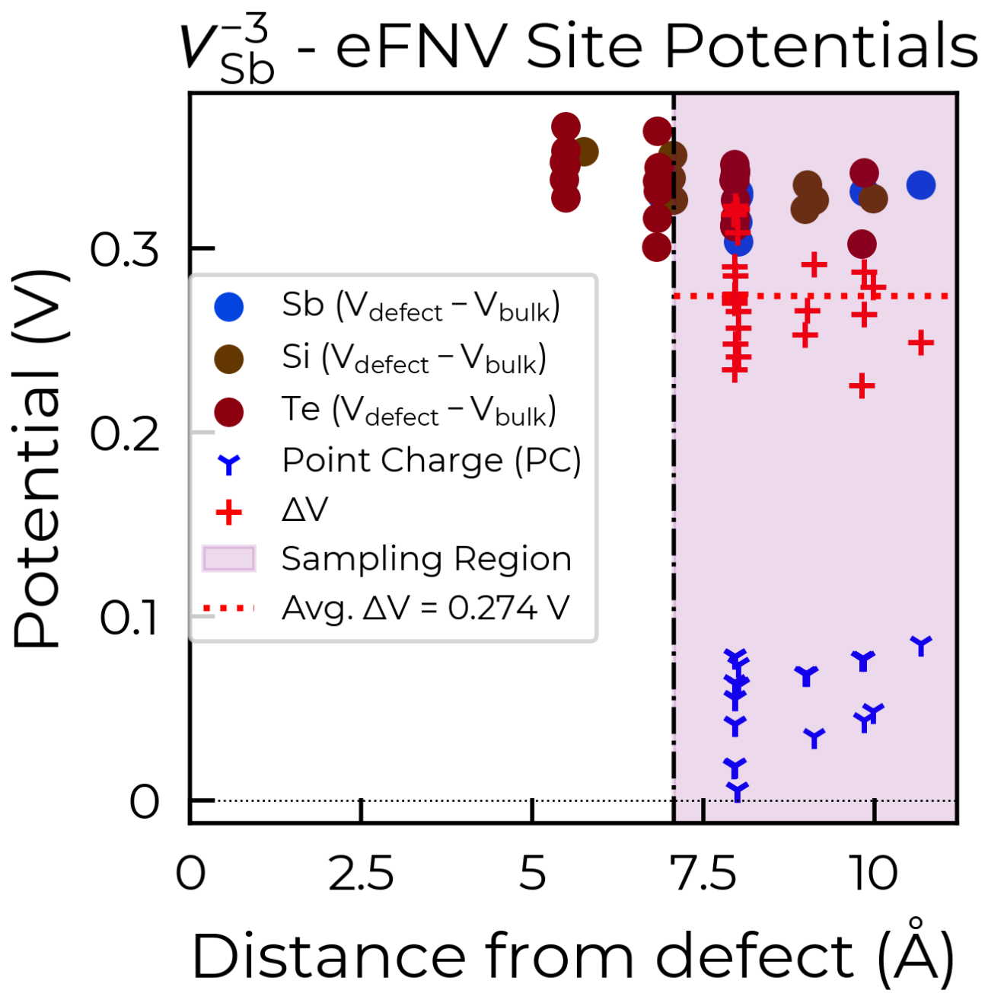

Tips & Tricks
============================

The development philosophy behind ``doped`` has been to try build a powerful, efficient and flexible code
for managing and analysing solid-state defect calculations, having reasonable defaults (that work well for
the majority of materials/defects) but with full flexibility for the user to customise the workflow to
their specific needs/system.

.. note::
    Much of the advice for defect calculations given here and elsewhere centres on the message that, while
    we try to provide some rough general rules-of-thumb for reasonable choices in the calculation workflow
    (based on the literature and our experience), there is no substitute for the user's own judgement.
    Defect behaviour can be incredibly system-dependent, and so it is `always` important to question and
    consider the choices and approximations made in the workflow (such as supercell choice, charge state
    ranges, interstitial site pruning, `MAGMOM` initialisation etc.) in the context of your specific
    host system.

Interstitials
-------------------
As described in the `YouTube defect calculation tutorial <https://youtu.be/FWz7nm9qoNg>`_, our
recommended workflow for calculating interstitial defects is to first generate the set of
candidate interstitial sites for your structure using ``DefectsGenerator`` (which uses Voronoi tessellation
for this, see note below), and then perform Gamma-point-only relaxations (using ``vasp_gam``) for each
charge state of the generated interstitial candidates, and then pruning some of the candidate sites based
on the criteria below. Typically the easiest way to do this is to follow the workflow shown in the defect
generation tutorial, and then run the ``ShakeNBreak`` ``vasp_gam`` relaxations for the ``Unperturbed`` and
``Bond_Distortion_0.0%``/``Rattled`` directories of each charge state. Alternatively you can generate the
``vasp_gam`` relaxation input files by setting ``vasp_gam = True`` in ``DefectsSet.write_files()``.

We can then compare the energies of these trial relaxations, and remove candidates that either:

- Are very high energy (~>1 eV above the lowest energy site for each charge state), and so are unlikely to form.

- Relax to the same final structure/energy as other interstitial sites (despite different initial
  positions) in each charge state, and so are unnecessary to calculate. This can happen due to interstitial
  migration within the relaxation calculation, from an unfavourable higher energy site, to a lower energy
  one. Typically if the energy from the test ``vasp_gam`` relaxations are within a couple meV of eachother,
  this is the case.

.. tip::

    As with many steps in the defect calculation workflow, these are only rough general rules-of-thumb and
    you should always critically consider the validity of these choices in the context of your specific
    system (for example, considering the charge-state dependence of the interstitial site formation
    energies here).

.. note::

    As mentioned above, by default Voronoi tessellation is used to generate the candidate interstitial
    sites in ``doped``. We have consistently found this approach to be the most robust in identifying all
    stable/low-energy interstitial sites across a wide variety of materials and chemistries. A nice
    discussion of this is given in
    `Kononov et al. J. Phys.: Condens. Matter 2023 <https://iopscience.iop.org/article/10.1088/1361-648X/acd3cf>`_.

    As with all aspects of the calculation workflow however, interstitial site generation is highly
    flexible, and you can explicitly specify the interstitial sites to generate using the
    ``interstitial_coords`` (for instance, if you only want to investigate one specific known interstitial
    site, or input a list of candidate sites generated from a different algorithm), and/or customise the
    generation algorithm via ``interstitial_gen_kwargs``, both of which are input parameters for the
    ``DefectsGenerator`` class;
    see the `API documentation <https://doped.readthedocs.io/en/latest/doped.generation.html#doped.generation.DefectsGenerator>`_
    for more details.

    Charge-density based approaches for interstitial site generation can be useful in some cases and often
    output less candidate sites, but we have found that these are primarily suited to ionic materials (and
    with fully-ionised defect charge states) where electrostatics primarily govern the energetics. In
    many systems (particularly those with some presence of (ionic-)covalent bonding) where orbital
    hybridisation plays a role, this approach can often miss the ground-state interstitial site(s).
    ..  If you are highly limited with computational resources and are working with (relatively simple) ionic compound(s), this approach may be worth considering.

Difficult Structural Relaxations
--------------------------------

If defect supercell relaxations do not converge after multiple continuation calculations
(i.e. ``cp``-ing ``CONTCAR`` to ``POSCAR`` and resubmitting the job), this is likely due to small
residual forces causing the local optimisation algorithm to struggle to find a solution, an error in the
underlying calculation and/or extreme forces.

- If the calculation outputs show that the relaxation is proceeding fine, without any errors, just not
  converging to completion, then it suggests that the structure relaxation is bouncing around a narrow
  region of the potential energy surface. Here, the gradient-based geometry optimiser is
  struggling to converge.

    - Often (but not always) this indicates that the structure may be stuck around a `saddle point` or
      shallow local minimum on the potential energy surface (PES), so it's important to make sure
      that you have performed structure-searching (PES scanning) with
      `ShakeNBreak <https://shakenbreak.readthedocs.io>`_ (``SnB``) to avoid this. You may want to try
      'rattling' the structure to break symmetry in case this is an issue, as detailed in
      `this part <https://shakenbreak.readthedocs.io/en/latest/Tips.html#bulk-phase-transformations>`_
      of the ``SnB`` docs.

    - **Alternatively (if you have already performed `SnB` structure-seaerching), convergence of the forces can be aided by:**
    - Switching the ionic relaxation algorithm back and forth (i.e. change :code:`IBRION` to :code:`1` or
      :code:`3` and back).
    - Reducing the ionic step width (e.g. change :code:`POTIM` to :code:`0.02` in the :code:`INCAR`)
    - Switching the electronic minimisation algorithm (e.g. change :code:`ALGO` to :code:`All`), if
      electronic convergence seems to be causing issues.
    - Tightening/reducing the electronic convergence criterion (e.g. change :code:`EDIFF` to :code:`1e-7`)

- If instead the calculation is crashing due to an error and/or extreme forces, a common culprit is the
  :code:`EDWAV` error in the output file, which can often be avoided by reducing :code:`NCORE` and/or
  :code:`KPAR`. If this doesn't fix it, switching the electronic minimisation algorithm (e.g. change
  :code:`ALGO` to :code:`All`) can sometimes help.

    - If some relaxations are still not converging after multiple continuations, you should check the
      calculation output files to see if this requires fixing. Often this may require changing a
      specific :code:`INCAR` setting, and using the updated setting(s) for any other relaxations that
      are also struggling to converge.

``ShakeNBreak``
-------------------

For tips on the ``ShakeNBreak`` part of the defect calculation workflow, please refer to the
`ShakeNBreak documentation <https://shakenbreak.readthedocs.io>`_.

Layered / Low-Dimensional Materials
--------------------------------------
Layered and low-dimensional materials can add some additional complications when performing defect analysis
in these systems. One point is that typically such lower symmetry materials exhibit higher rates of
energy-lowering defect reconstructions (e.g.
`4-electron negative-U centres in Sb₂Se₃ <https://doi.org/10.1103/PhysRevB.108.134102>`_), as a result of
having more complex energy landscapes.

Another is that often the application of charge correction schemes to supercell calculations with layered
materials may require some fine-tuning for converged results. To illustrate, for Sb₂Si₂Te₆ (
`a promising layered thermoelectric material <https://doi.org/10.26434/chemrxiv-2024-hm6vh>`_),
when parsing the intrinsic defects, the -3 charge antimony vacancy (``v_Sb-3``) gave this warning:

.. code-block::

        Estimated error in the Kumagai (eFNV) charge correction for defect v_Sb_-3 is 0.067 eV (i.e. which is
        greater than the `error_tolerance`: 0.050 eV). You may want to check the accuracy of the correction by
        plotting the site potential differences (using `defect_entry.get_kumagai_correction()` with `plot=True`).
        Large errors are often due to unstable or shallow defect charge states (which can't be accurately modelled
        with the supercell approach). If this error is not acceptable, you may need to use a larger supercell
        for more accurate energies.

Following the advice in the warning, we use ``defect_entry.get_kumagai_correction(plot=True)`` to plot the
site potential differences for the defect supercell (which is used to obtain the eFNV (Kumagai-Oba)
anisotropic charge correction):

From the eFNV plot, we can see that there appears to be two distinct sets of site potentials, with one
curving up from ~-0.4 V to ~0.1 V, and another mostly constant set at ~0.3 V. We can understand this by
considering the structure of our defect (shown on the right), where the location of the Sb vacancy (hidden
by the projection along the plane) is circled in green – we can see the displacement of the Sb atoms on
either side.

Due to the layered structure, the charge and strain associated with the defect is mostly confined to the
defective layer, while that of the layer away from the defect mostly experiences the typical long-range
electostatic potential of the defect charge. The same behaviour can be seen for `h`-BN in the
`original eFNV paper <https://doi.org/10.1103/PhysRevB.89.195205>`_ (Figure 4d).
This means that our usual default of using the
Wigner-Seitz radius to determine the sampling region is not as good, as it's including sites in the
defective layer (circled in orange) which are causing the variance in the potential offset (ΔV) and thus
the error in the charge correction.

To fix this, we can use the optional ``defect_region_radius`` or ``excluded_indices`` parameters in
``get_kumagai_correction``, to exclude those points from the sampling. For ``defect_region_radius``, we
can just set this to 8.75 Å here to avoid those sites in the defective layer. Often it may not be so simple
to exclude the intra-layer sites in this way (depending on the supercell), and so alternatively we can use
``excluded_indices`` for more fine-grained control. As we can see in the structure image above, the `a`
lattice vector is aligned along the inter-layer direction, so we can determine the intra-layer sites using
the fractional coordinates of the defect site along `a`:

.. code-block:: python

    # get indices of sites within 0.2 fractional coordinates along a of the defect site
    sites_in_layer = [
        i for i, site in enumerate(defect_entry.defect_supercell)
        if abs(site.frac_coords[0] - defect_entry.defect_supercell_site.frac_coords[0]) < 0.2
    ]
    correction, fig =  dp.defect_dict["v_Sb-3"].get_kumagai_correction(
        excluded_indices=sites_in_layer, plot=True
    )  # note that this updates the DefectEntry.corrections value, so the updated correction
    # is used in later formation energy / concentration calculations

Below are the two resulting charge correction plots (using ``defect_region_radius`` on the left, and
``excluded_indices`` on the right):

.. image:: Sb2Si2Te6_v_Sb_-3_eFNV_plot_region_radius.png
    :width: 320px
    :align: left

.. note::

    Have any tips for users from using ``doped``? Please share it with the developers and we'll add them here!