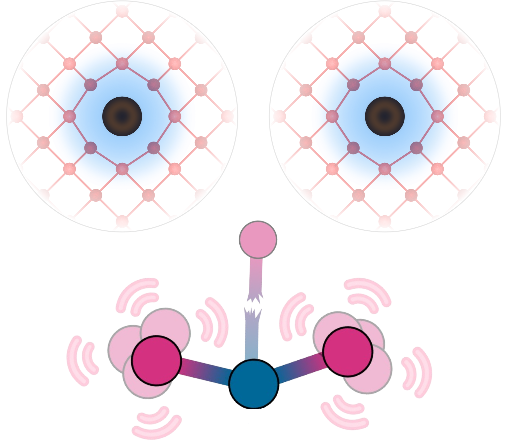

\|
========================================================
**The doped logo kinda looks like an eyeball doesn't it?**

I'm glad you asked.

So after returning home from a quiet night's walk in the Irish countryside circa late-2020 –
'mid-COVID', similar to
the fresh-air evenings where `SnB <https://shakenbreak.readthedocs.io/en/latest/>`_ was conceived, I was
struck by the sight of my bloodshot eyes in the mirror.

'F*ck it's so obvious I'm blazed', I exclaimed (internally, obviously). `'What will Mam and Dad think?'`
(It's ok, I'll just tell them I'm drunk, that's way more socially-acceptable to boomers?!).
As I stared into my red (af) eyes in the mirror, I realised that in that moment I was in fact `"doped"`.

    **doping** (noun): The addition of (a small amount of) an extrinsic substance to a host, to alter its
    properties.

"I'm not the same when I'm sober" as `AJ Tracey <https://youtu.be/tJSM1xjMMRE?si=GgOjzFdjEnlinpHy>`_ would
say, or "I have never doped" – Lance Armstrong.
What better logo to use for the defect code (``doped``) I was developing at the time, than a
close-up shot of my bloodshot eyeball, illustrating the effects of doping?

When I later returned to sobriety I did resign myself to the fact that an `actual` close-up of my
bloodshot eyeball might not be totally "professional" according to some
people(`? <https://www.washingtonpost.com/blogs/the-fix/files/2016/12/TrumpDebate_CNN.gif>`_)... So I
went with something that iykyk, but to
a civilian merely looks like some atoms that coincidentally resemble an eyeball.

| So yes, yes it is an eyeball. A bloodshot, 'doped' eyeball specifically.
| Thank you for coming to my TED talk.