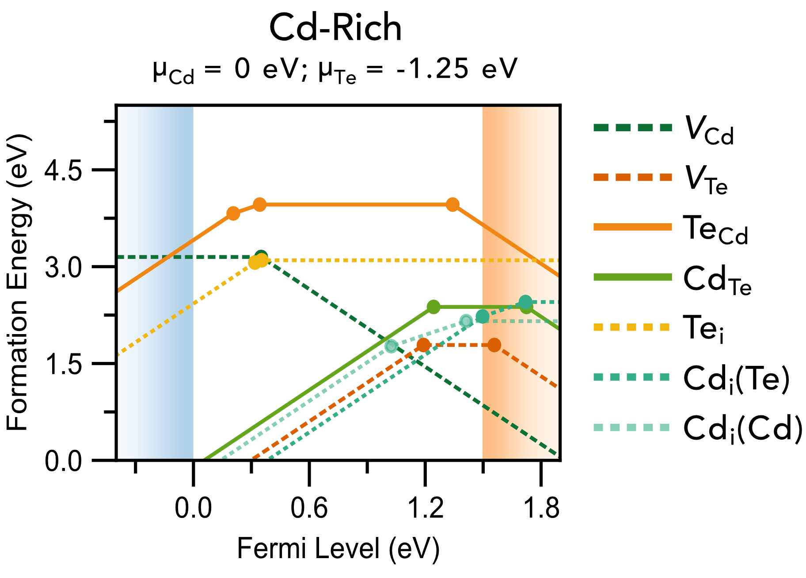

doped
=====

.. image:: https://github.com/SMTG-Bham/doped/actions/workflows/test.yml/badge.svg
   :target: https://github.com/SMTG-Bham/doped/actions
.. image:: https://readthedocs.org/projects/doped/badge/?version=latest&style=flat
   :target: https://doped.readthedocs.io/en/latest/
.. image:: https://img.shields.io/pypi/v/doped
   :target: https://pypi.org/project/doped
.. image:: https://img.shields.io/conda/vn/conda-forge/doped.svg
   :target: https://anaconda.org/conda-forge/doped
.. image:: https://img.shields.io/pypi/dm/doped
   :target: https://pypi.org/project/doped

.. raw:: html

   

``doped`` is a Python package for managing solid-state defect calculations, with functionality to
generate defect structures and relevant competing phases (for chemical potentials), interface with
`ShakeNBreak`_ for defect structure-searching, write VASP input files for defect supercell calculations,
and automatically parse and analyse the results.

Example Outputs:
-----------------
Chemical potential/stability region plots and defect formation energy (a.k.a. transition level) diagrams:

.. raw:: html

    
    
    
    
    
    
    
    
    
    
    

Tutorials showing the code functionality and usage are provided on the :ref:`Tutorials` page.

``doped`` can be installed via PyPI (``pip install doped``) or ``conda`` if preferred, and further
instructions for setting up ``POTCAR`` files with ``pymatgen`` (needed for input file generation), if not
already done, are provided on the :ref:`Installation` page.

``ShakeNBreak``
================
As shown in the tutorials, it is highly recommended to use the `ShakeNBreak`_ approach when calculating
point defects in solids, to ensure you have identified the ground-state structures of your defects. As
detailed in the `theory paper`_, skipping this step can result in drastically incorrect formation
energies, transition levels, carrier capture (basically any property associated with defects). This
approach is followed in the :ref:`tutorials <Tutorials>`, with a more in-depth explanation and tutorial
given on
the
`ShakeNBreak`_ docs.

.. _theory paper: https://www.nature.com/articles/s41524-023-00973-1
.. _tutorials: https://www.nature.com/articles/s41524-023-00973-1 # TODO!!!

Summary GIF:

.. image:: https://raw.githubusercontent.com/SMTG-Bham/ShakeNBreak/main/docs/SnB_Supercell_Schematic_PES_2sec_Compressed.gif

``SnB`` CLI Usage:

.. image:: https://raw.githubusercontent.com/SMTG-Bham/ShakeNBreak/main/docs/SnB_CLI.gif

.. raw:: html

    
    
    
    

Acknowledgements
================
``doped`` (née ``DefectsWithTheBoys`` #iykyk) has benefitted from feedback from many
users, in particular members of the `Scanlon <http://davidscanlon.com/>`_ and
`Walsh <https://wmd-group.github.io/>`_ research groups who are using it in
their work. Direct contributors are listed in the GitHub ``Contributors`` sidebar; including Seán
Kavanagh, Bonan Zhu, Katarina Brlec, Adair Nicolson, Sabrine Hachmioune and Savya Aggarwal.

Code to efficiently identify defect species from input supercell structures was contributed by
`Alex Ganose`_, and the colour scheme for defect formation energy plots was originally templated from
the ``aide`` package, developed by `Adam Jackson`_ and `Alex Ganose`_.

The `docs`_ website setup was templated from the ``ShakeNBreak`` docs set up by `Irea Mosquera-Lois`_ 🙌

``doped`` was originally based on the excellent `PyCDT`_ (no longer maintained), but transformed and
morphed over time as more and more functionality was added. After breaking changes in ``pymatgen``, the
package was rewritten to operate using the new ``pymatgen-analysis-defects`` package.

Studies using ``doped``, so far
===============================

- X\. Wang et al. **Upper efficiency limit of Sb₂Se₃ solar cells** `arXiv <https://arxiv.org/abs/2402.04434>`_ 2024
- I\. Mosquera-Lois et al. **Machine-learning structural reconstructions for accelerated point defect calculations** `arXiv <https://doi.org/10.48550/arXiv.2401.12127>`_ 2024
- W\. Dou et al. **Giant Band Degeneracy via Orbital Engineering Enhances Thermoelectric Performance from Sb₂Si₂Te₆ to Sc₂Si₂Te₆** `ChemRxiv <https://doi.org/10.26434/chemrxiv-2024-hm6vh>`_ 2024
- K\. Li et al. **Computational Prediction of an Antimony-based n-type Transparent Conducting Oxide: F-doped Sb₂O₅** `ChemRxiv <https://chemrxiv.org/engage/chemrxiv/article-details/65846b8366c1381729bc5f23>`_ 2024
- X\. Wang et al. **Four-electron negative-U vacancy defects in antimony selenide** `Physical Review B <https://journals.aps.org/prb/abstract/10.1103/PhysRevB.108.134102>`_ 2023
- Y\. Kumagai et al. **Alkali Mono-Pnictides: A New Class of Photovoltaic Materials by Element Mutation** `PRX Energy <http://dx.doi.org/10.1103/PRXEnergy.2.043002>`__ 2023
- S\. M. Liga & S. R. Kavanagh, A. Walsh, D. O. Scanlon, G. Konstantatos **Mixed-Cation Vacancy-Ordered Perovskites (Cs₂Ti** :sub:`1–x` **Sn** :sub:`x` **X₆; X = I or Br): Low-Temperature Miscibility, Additivity, and Tunable Stability** `Journal of Physical Chemistry C`_ 2023
- A\. T. J. Nicolson et al. **Cu₂SiSe₃ as a promising solar absorber: harnessing cation dissimilarity to avoid killer antisites** `Journal of Materials Chemistry A <https://doi.org/10.1039/D3TA02429F>`__ 2023
- Y\. W. Woo, Z. Li, Y-K. Jung, J-S. Park, A. Walsh **Inhomogeneous Defect Distribution in Mixed-Polytype Metal Halide Perovskites** `ACS Energy Letters <https://doi.org/10.1021/acsenergylett.2c02306>`__ 2023
- P\. A. Hyde et al. **Lithium Intercalation into the Excitonic Insulator Candidate Ta₂NiSe₅** `Inorganic Chemistry <https://doi.org/10.1021/acs.inorgchem.3c01510>`_ 2023
- J\. Willis, K. B. Spooner, D. O. Scanlon. **On the possibility of p-type doping in barium stannate** `Applied Physics Letters <https://doi.org/10.1063/5.0170552>`__ 2023
- J\. Cen et al. **Cation disorder dominates the defect chemistry of high-voltage LiMn** :sub:`1.5` **Ni** :sub:`0.5` **O₄ (LMNO) spinel cathodes** `Journal of Materials Chemistry A`_ 2023
- J\. Willis & R. Claes et al. **Limits to Hole Mobility and Doping in Copper Iodide** `Chem Mater <https://doi.org/10.1021/acs.chemmater.3c01628>`__ 2023
- I\. Mosquera-Lois & S. R. Kavanagh, A. Walsh, D. O. Scanlon **Identifying the ground state structures of point defects in solids** `npj Computational Materials`_ 2023
- Y\. T. Huang & S. R. Kavanagh et al. **Strong absorption and ultrafast localisation in NaBiS₂ nanocrystals with slow charge-carrier recombination** `Nature Communications`_ 2022
- S\. R. Kavanagh, D. O. Scanlon, A. Walsh, C. Freysoldt **Impact of metastable defect structures on carrier recombination in solar cells** `Faraday Discussions`_ 2022
- Y-S\. Choi et al. **Intrinsic Defects and Their Role in the Phase Transition of Na-Ion Anode Na₂Ti₃O₇** `ACS Appl. Energy Mater. <https://doi.org/10.1021/acsaem.2c03466>`__ 2022
- S\. R. Kavanagh, D. O. Scanlon, A. Walsh **Rapid Recombination by Cadmium Vacancies in CdTe** `ACS Energy Letters <https://pubs.acs.org/doi/full/10.1021/acsenergylett.1c00380>`__ 2021
- C\. J. Krajewska et al. **Enhanced visible light absorption in layered Cs₃Bi₂Br₉ through mixed-valence Sn(II)/Sn(IV) doping** `Chemical Science`_ 2021

.. Xinwei early 2024 paper
.. Se
.. Oba book
.. BiOI
.. Kumagai collab paper
.. Lavan LiNiO2
.. Sykes Magnetic oxide polarons
.. Kat YTOS
.. Squires (and mention benchmark test against AIRSS? See Slack message)

.. _Journal of Physical Chemistry C: https://doi.org/10.1021/acs.jpcc.3c05204
.. _Journal of Materials Chemistry A: https://doi.org/10.1039/D3TA00532A
.. _npj Computational Materials: https://www.nature.com/articles/s41524-023-00973-1
.. _Nature Communications: https://www.nature.com/articles/s41467-022-32669-3
.. _Faraday Discussions: https://doi.org/10.1039/D2FD00043A
.. _Chemical Science: https://doi.org/10.1039/D1SC03775G

.. _ShakeNBreak: https://shakenbreak.readthedocs.io
.. _docs: https://doped.readthedocs.io
.. _Irea Mosquera-Lois: https://scholar.google.com/citations?user=oIMzt0cAAAAJ&hl=en
.. _PyCDT: https://www.sciencedirect.com/science/article/pii/S0010465518300079
.. _Adam Jackson: https://github.com/ajjackson
.. _Alex Ganose: https://github.com/utf

.. raw:: html

    <!-- Default Statcounter code for doped docs
    https://doped.readthedocs.io -->
    
    
    <noscript>

</noscript>
    <!-- End of Statcounter Code -->

.. toctree::
   :hidden:
   :caption: Usage
   :maxdepth: 4

   Installation
   Python API <doped>
   Tutorials
   Tips
   Troubleshooting

.. toctree::
   :hidden:
   :caption: Information
   :maxdepth: 1

   Contributing
   Code_Compatibility
   changelog_link
   doped on GitHub <https://github.com/SMTG-Bham/doped>
